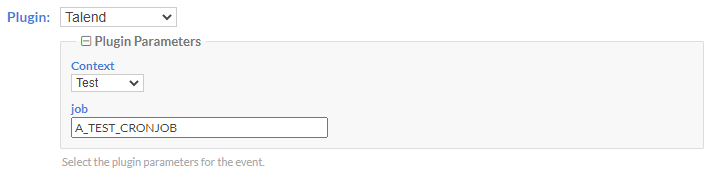
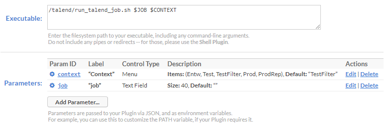

# Talend-Open-Studio-Cronicle-Plugin-Script
A bash Script to run Talend Open Studio Jobs within Cronicle (https://github.com/jhuckaby/Cronicle) as a Plugin.

This script is searching for Jobs and starting them with the given context from Cronicle.

You can use "find . -name '*.zip' -execdir unzip -o -q '{}' ';'" as a job to automatically extract the build Job .zip Archives.

# How to use
1. Set up Cronicle
2. Create new Plugin in (Admin > Plugins)
3. add "context" and "job" as Parameters
4. Set "run_talend_job.sh $JOB $CONTEXT" in the Field Executeable

Now you can simply select a Job and Context when you create a new Schedule Event

